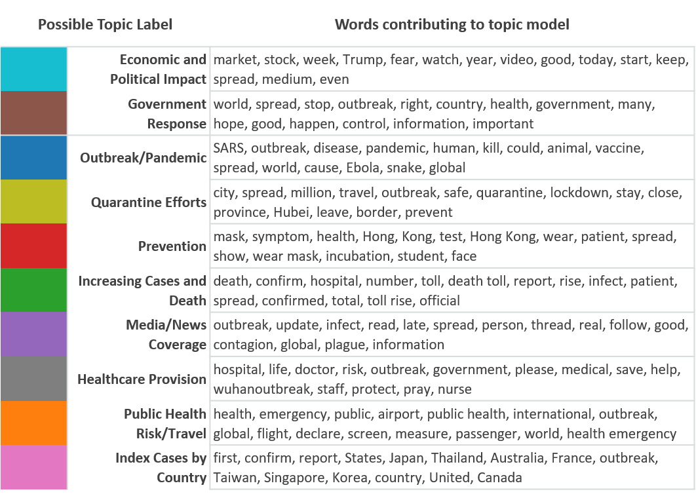

# Overview
We leverage social data streams like Twitter, Reddit, and Google Trends to understand public sentiment, evaluate discussed topics, and identify dispersion of misinformation and disinformation about the COVID-19 pandemic.  

# Goal 
We plan to utlize automated bots to tailor individualized public health messages in real-time based on user emotion and interest.  

# Projects

## An Early Twitter Analysis of the COVID-19 Outbreak

**Below is a sample figure from this work that utlizes a natural language processing algortihm to identify topics discussed by Twitter user in the early (January 14 - 28) stages of the COVID-19 outbreak.**

**Figure 6a.** 
The fifteen terms (in order of weighting) that contributed to each abstract topic with their potential theme labels. The topics are ordered by frequency. Colors for each topic correspond to those in Figure 6b. Topic labels were assigned by the authors. 

**Figure 6b.**
A t-distributed Stochastic Neighbor Embedding (t-SNE) graph embeds high-dimensional data into a two-dimensional space for visualization where similar nodes are grouped together. We visualize the topics in Figure 6a as labeled by color. Each node represents an individual tweet and only tweets posted through the day highlighted on the slider are shown in the foreground, while all tweets in the study period are shown in the background. Hovering over any node will show the text of tweets and the days they were posted. _Note the visualization may take a few minutes to load._

<iframe src="https://tsne-topic-twitter-ncov2019.herokuapp.com/tsne_deploy"
    sandbox="allow-same-origin allow-scripts"
    width="1000"
    height="1000"
    scrolling="yes"
    seamless="seamless"
    frameborder="0">
</iframe>
